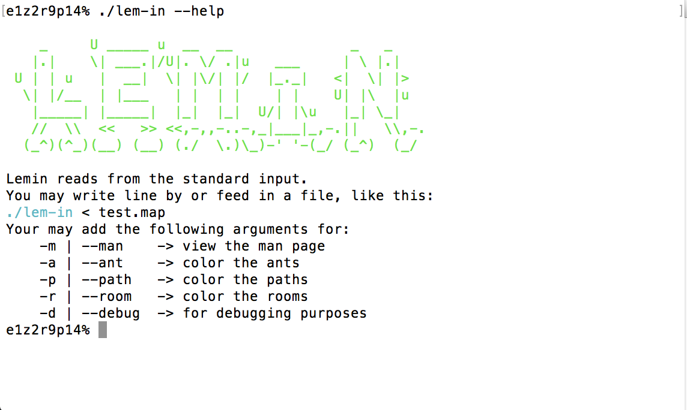
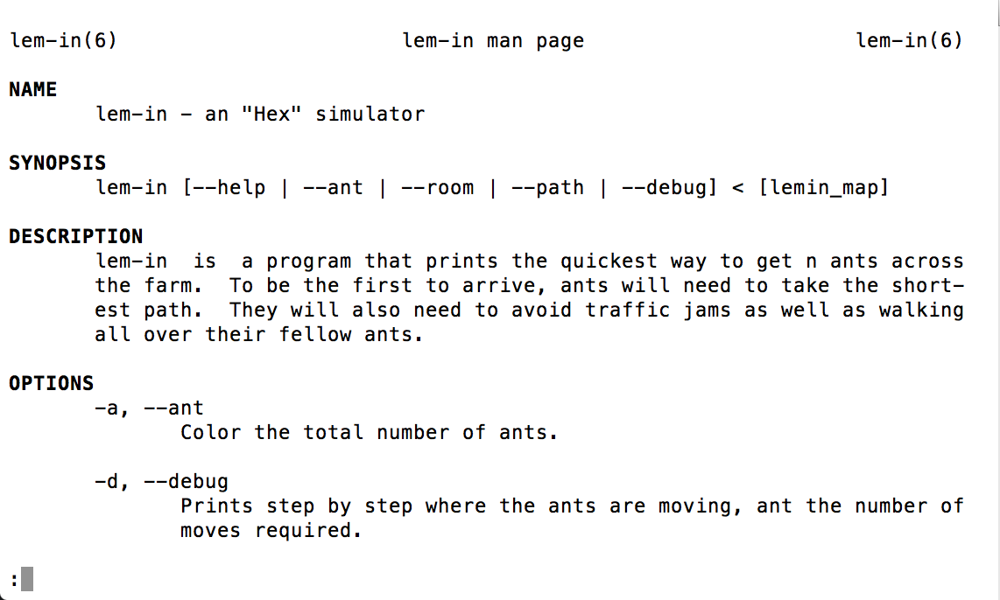
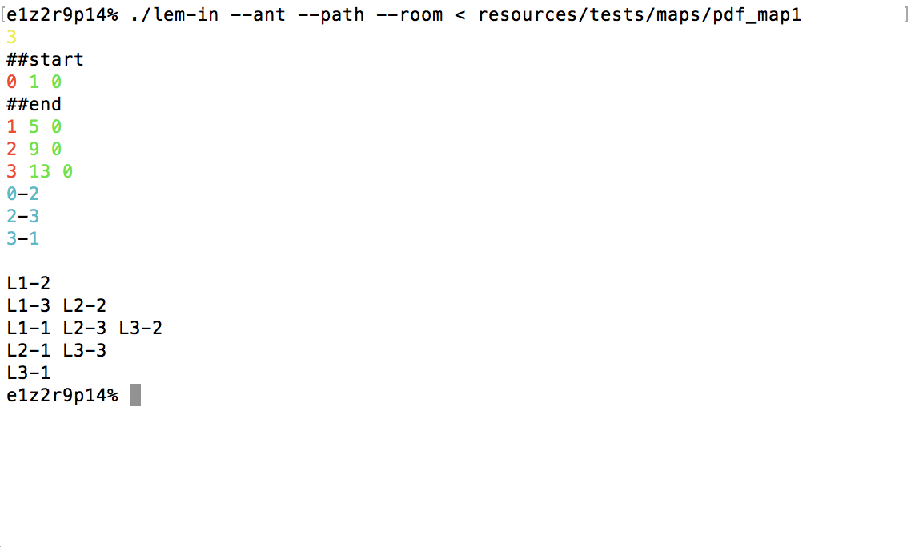
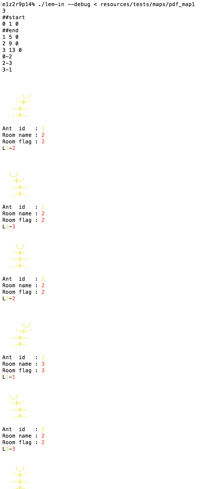

# École 42

## Lem-in

An "Hex" simulator.
lem-in is a program that prints the quickest way to get n ants across the farm.
To be the first to arrive, ants will need to take the shortest path.
They will also need to avoid traffic jams as well as walking all over their
fellow ants.

### Options

| Flags          | Description                                                                      |
| :--------------|:---------------------------------------------------------------------------------|
| `--ant (-a)`   | Color the total number of ants.                                                  |
| `--debug (-d)` | Prints step by step where the ants are moving, ant the number of moves required. |
| `--help (-h)`  | Display a message on how to use lem-in, and the available parameters.            |
| `--man (-m)`   | Shows the lem-in man page                                                        |
| `--path (-p)`  | Color the paths from the map.                                                    |
| `--room (-r)`  | Color the rooms from the map.                                                    |

## Getting Started

### Compiling

Run the following commands:

* To compile
	- `make`
* To remove objects:
	- `make clean`
* To remove objects and binary file (program):
	- `make fclean`
* To re-compile:
	- `make re`

### Running

To run the program:

`./lemin < path/to/map.txt`

## Screenshots

> Lem-in's Help message.

> Lem-in's Man page.

> Running lem-in with the ant, path, and room flag.

> Running lem-in's debug visualizer.

## Bugs

* Bonus doesn't work on Linux (but man page does).
